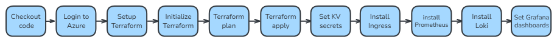

# Project Documentation

Welcome to the documentation for **Group 2 Final Project**.  
This folder contains all supporting materials — screenshots, architecture diagrams, and monitoring visuals — to help understand and visualize the project structure.

---

## 1. Demo Screenshots

Located in [`docs/demo`](./demo)

### Main Page

### Orders Page

### Confirmation Page

## 2️. System & Pipeline Diagrams

Located in [`docs/diagrams`](./diagrams)

### System Architecture

---

### Pipelines Overview

Located in [`docs/diagrams/02-pipelines`](./diagrams/02-pipelines)

#### Infrastructure

#### Kubernetes

#### Backend Pipeline

#### Frontend Pipeline

---

## 3. Monitoring Screenshots

Located in [`docs/monitoring`](./monitoring)

### Frontend Monitoring

#### Pod Logs

#### Pod Metrics

---

### Backend Monitoring

#### Pod Logs

#### Pod Metrics

---

### Node Monitoring

---

## Related References

- [Main Project README](../README.md)
